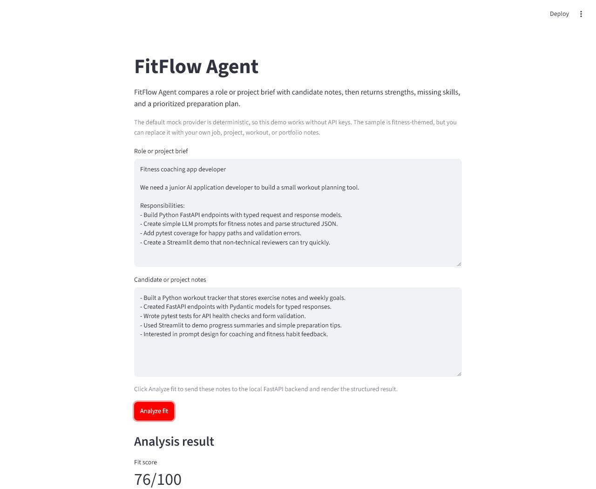

# FitFlow Agent

[](https://github.com/BomB1961/fitflow-agent/actions/workflows/ci.yml)

## 한 줄 소개

FitFlow Agent는 채용공고와 지원자 프로필을 비교해 강점, 부족한 역량, 우선순위 기반 준비 계획을 생성하는 AI/LLM 포트폴리오 MVP입니다.

## 데모 화면

아래 화면은 기본 mock mode로 실행한 Streamlit 로컬 데모 예시입니다.



## Live API Demo

FastAPI backend는 Render에 배포되어 있습니다.

- Live API: https://fitflow-agent-api.onrender.com
- Swagger UI: https://fitflow-agent-api.onrender.com/docs
- Health check: https://fitflow-agent-api.onrender.com/health

배포된 API는 기본 `mock` provider를 사용하므로 API key 없이 확인할 수 있습니다. Render free plan 특성상 비활성 상태 이후 첫 요청은 시간이 걸릴 수 있습니다.

## 프로젝트 목적

- 구직자는 채용공고를 보고도 무엇을 우선 준비해야 할지 판단하기 어렵습니다.
- 이 프로젝트는 채용공고와 지원자 프로필을 입력받아 구체적인 준비 방향을 제안합니다.
- 실제 채용 플랫폼이 아니라, 작은 범위에서 끝까지 동작하는 AI/LLM 포트폴리오 MVP입니다.

## 주요 기능

- FastAPI 기반 분석 API
- Pydantic 기반 구조화된 응답 모델
- 테스트와 데모에 안정적인 deterministic mock provider
- 선택적으로 사용할 수 있는 OpenAI-compatible provider
- 샘플 채용공고, 지원자 프로필, 샘플 출력
- Streamlit 기반 로컬 데모 UI
- Pytest 테스트
- GitHub Actions CI

## 데모 흐름

1. FastAPI backend 실행
2. FastAPI docs 또는 Streamlit UI 열기
3. 샘플 채용공고와 지원자 프로필 입력
4. 강점, 부족한 역량, 우선순위 기반 준비 계획 확인

기본 mock mode는 API key 없이 실행됩니다.

## 아키텍처

```text
사용자
-> Streamlit UI 또는 FastAPI docs
-> FastAPI /analyze endpoint
-> LLM provider layer
   -> mock provider 기본값
   -> OpenAI-compatible provider 선택 사용
-> 구조화된 분석 결과
```

## 기술 스택

- Python
- FastAPI
- Pydantic
- Pytest
- Streamlit
- python-dotenv
- GitHub Actions
- Optional OpenAI-compatible API

## 설치 방법

```powershell
python -m venv .venv
.\.venv\Scripts\Activate.ps1
python -m pip install -e ".[dev,ui]"
```

`.env.example`을 `.env`로 복사하는 것은 provider 설정을 바꾸고 싶을 때만 필요합니다. 기본 mock mode는 별도 API credential 없이 동작합니다.

## API 실행

```powershell
uvicorn app.main:app --reload
```

`http://localhost:8000/docs`에서 Swagger UI를 확인할 수 있습니다.

## 샘플 분석 실행

FastAPI 서버를 실행한 뒤, 새 PowerShell 터미널에서 아래 명령을 실행합니다.

```powershell
$body = @{
  job_posting = Get-Content -Raw samples/job_posting.txt
  candidate_profile = Get-Content -Raw samples/candidate_profile.txt
} | ConvertTo-Json

Invoke-RestMethod -Method Post -Uri http://localhost:8000/analyze -ContentType "application/json" -Body $body
```

응답 예시는 `samples/sample_output.json`에서 확인할 수 있습니다.

## Streamlit 데모 실행

API 서버를 먼저 실행해야 합니다.

```powershell
streamlit run ui/streamlit_app.py
```

Streamlit UI는 기본적으로 `http://localhost:8000`의 API를 호출합니다. 다른 API 주소를 사용하려면 `FITFLOW_API_URL`로 지정할 수 있습니다.

## 테스트 실행

```powershell
pytest
```

테스트는 실제 LLM API credential 없이 실행되도록 설계되어 있습니다.

## Provider Modes

- `mock`: 기본값입니다. deterministic하게 동작하므로 테스트와 포트폴리오 데모에 권장합니다.
- `openai`: OpenAI-compatible API를 이용한 수동 실험용 선택 provider입니다.

실제 API key는 테스트나 기본 로컬 데모 실행에 필요하지 않습니다.

## 포트폴리오 관점에서 보여주는 것

- Backend API 설계
- 구조화된 LLM 응답 처리
- 테스트 가능한 provider abstraction
- 로컬 데모 UI 구성
- 환경변수 기반 설정 관리
- GitHub Actions 기반 CI 검증
- 실용적인 AI 애플리케이션 문제 정의

이 프로젝트는 junior AI/LLM/backend 포트폴리오에서 작은 문제를 정의하고, API, 테스트, 샘플, 로컬 데모까지 연결해 끝까지 동작하게 만든 사례를 보여주는 데 초점을 둡니다. 전체 채용 서비스나 production system을 목표로 한 프로젝트는 아닙니다.

## 현재 범위와 향후 개선 방향

현재 포함:

- FastAPI backend
- mock provider
- Optional OpenAI-compatible provider
- Streamlit demo
- Samples
- Tests
- CI

아직 포함하지 않음:

- Web scraping
- Authentication
- Database persistence
- Embeddings/vector search
- Multi-agent orchestration
- Deployment

향후 개선 가능:

- 분석 기록 저장
- UI 결과 표시 개선
- 배포
- 더 현실적인 평가 예시 추가
- 이력서/프로필 파일 업로드

## 배포 준비: Render

이 저장소에는 FastAPI backend를 Render에 배포하기 위한 `render.yaml`이 포함되어 있습니다. 기본 배포 설정은 `mock` provider를 사용하므로 API key 없이 실행할 수 있습니다.
현재 live backend URL은 `https://fitflow-agent-api.onrender.com`입니다.

Render start command는 아래와 같습니다.

```powershell
uvicorn app.main:app --host 0.0.0.0 --port $PORT
```

배포 준비 흐름:

1. Render에서 New + Blueprint를 선택합니다.
2. GitHub repository를 연결합니다.
3. `render.yaml` 설정을 확인합니다.
4. 배포 후 `/health` 또는 `/docs`에서 API 상태를 확인합니다.

`/docs`에서 API를 직접 테스트할 수 있습니다. Streamlit UI 배포는 별도 작업이며, 이 Render 설정에는 FastAPI backend만 포함됩니다. OpenAI-compatible provider를 사용하려면 Render 환경변수로 설정하고, API key는 저장소에 커밋하지 않습니다.

## 라이선스

이 프로젝트는 MIT License를 따릅니다. 자세한 내용은 [LICENSE](LICENSE)를 참고하세요.
